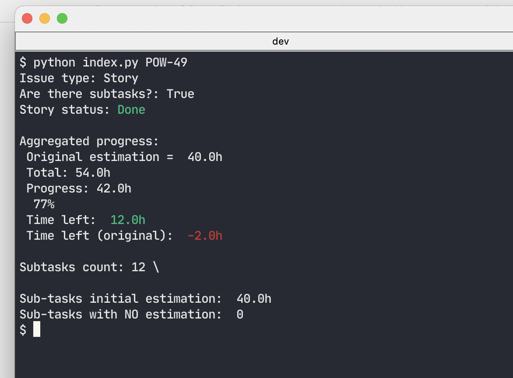
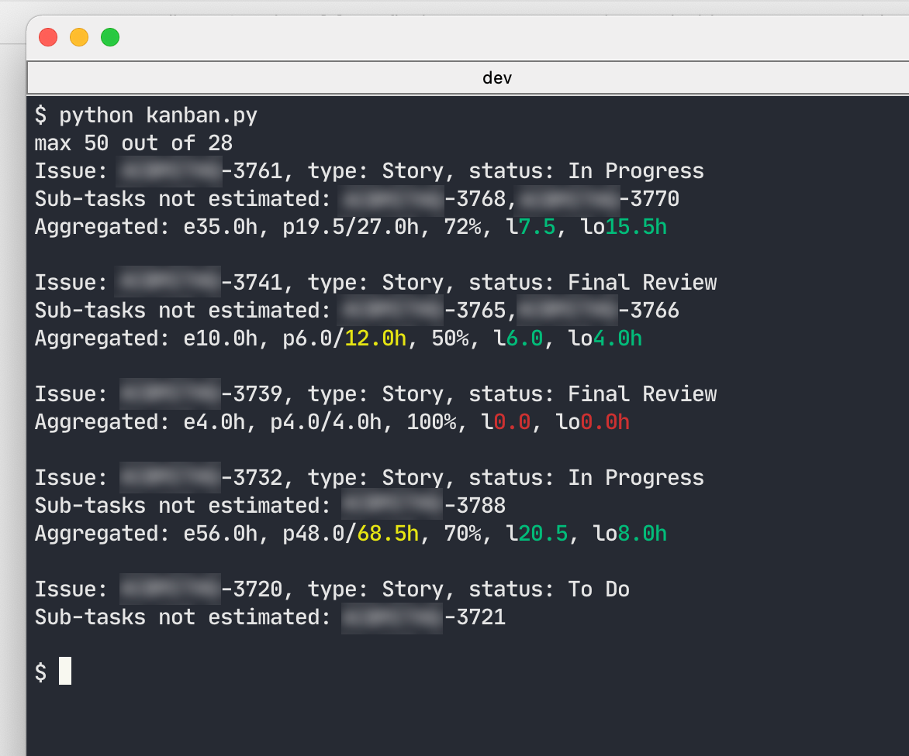

  

# Jira tasks analysis tool

CLI tools for a quick analysis of Jira tasks and Kanban boards. Useful for scrum-master, product/project managers.

## About

__Task:__ quickly get analysis of the single project issue (Story/Issue/Sub-task/Bug)



Here one can get information about original issue's statistics (if anyboady has reported to the issue), aggregated statistics (if the current issue has sub-tasks), number of sub-tasks, number of them without estimation yet.

Total value displays the current estimation, corrected along the progress.

_Time left_ - regarding Total estimation value.

_Time left (original)_ - if total would not be corrected. Helpful to get an understanding of the initial estimation failure.

__Task:__ quickly get analysis of the project's board



Here one can get a list of issues (searching types can be defined in code) and original issue stats vs aggregated one (if there are sub-tasks). As well as a list of tasks to be estimated yet.


_e_ - estimation

_p_ - progress: hours spent next to total estimation

_l_ - hours left (total estimation)

_lo_ - hours left (according to the original estimation)

## How to use

At first please fill in _config.ini_.

_authentication-token_ is a _Base64_ crypted characters: __JIRA_EMAIL:API_TOKEN__. API token can be taken from here: https://id.atlassian.com/manage-profile/security/api-tokens

_filterId_ - board id. It can be taken from board settings _... (three dots) -> Board settings -> General -> Edit Filter Query_. Once page is loaded - taken board id from URL: ...issues/?filter=__NUMBER__

### Analyze single issue
```bash
$ python index.py ISSUE

# or run as an executable script (Unix/Linux/MacOs)
$ ./index.py ISSUE
```

### Analyze Jira board
```bash
$ python kanban.py

# or run as an executable script (Unix/Linux/MacOs)
$ ./kanban.py
```

## How to install

```bash
$ pip install -r requirements.txt
```